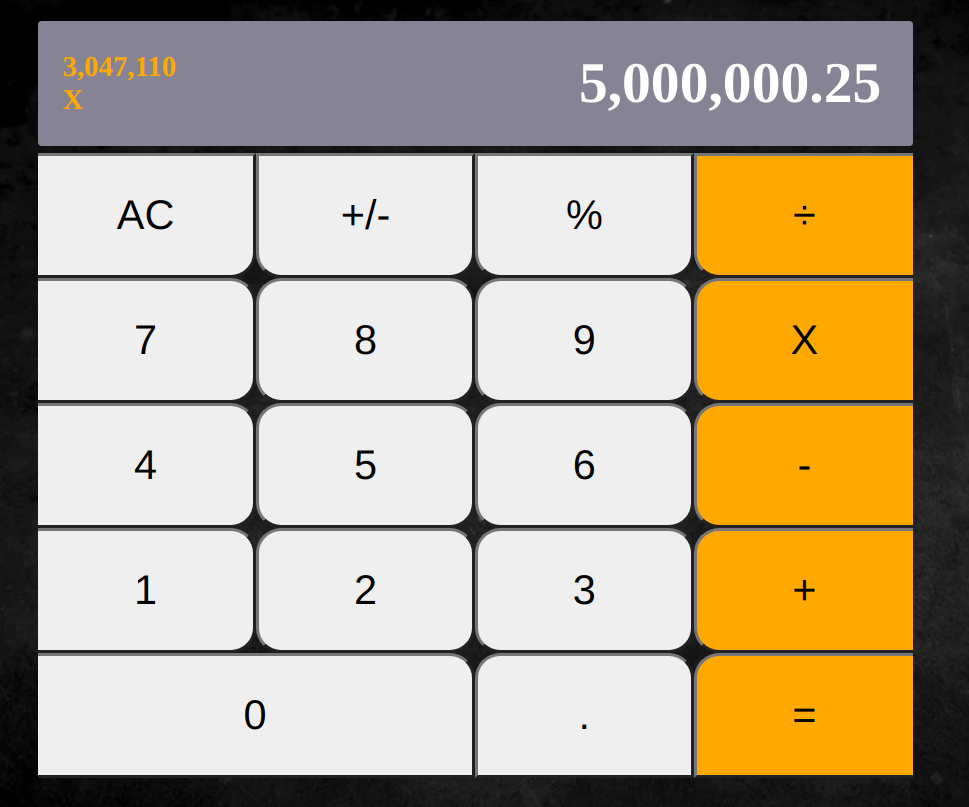

# Calculator

> With this calculator app you can calculate your basic math operations.
> It has been built with React.

## Live Demo

[Live Demo Link](https://kubilay-calculator.herokuapp.com/)

## Features

- Keyboard control.
- Automatic thousand seperators.
- Chain calculations.
- Visible last result.

## Future Features

- Square root operation
- Square operation
- Modulo operation

## Built With

- JavaScript
- React
- Create-react-app
- Big.js

## Getting Started

To get a local copy up and running follow these simple example steps.

### Prerequisites

- A modern browser
- Text editor

### Setup

- Clone repository  `git clone https://github.com/kubilaycaglayan/calculator.git`.
- Switch to the current working branch `git checkout calculator`.
- Install dependencies `npm install`.

### Usage

- Run the app `npm start`

### Run tests

- After "Setup" stage do the following:
- Enter the following command into the terminal `npm run test`.
- Push the "a" button on your keyboard to run all the tests.

## Author

👤 **Kubilay Caglayan**

- Website: [kubilay](https://kubilaycaglayan.com)
- Github: [@kubilaycaglayan](https://github.com/kubilaycaglayan)
- Twitter: [@kbcaglayan](https://twitter.com/kbcaglayan)
- Linkedin: [linkedin](https://linkedin.com/in/kubilaycaglayan)

## 🤝 Contributing

Contributions, issues and feature requests are welcome!

Feel free to check the [issues page](https://github.com/kubilaycaglayan/calculator/issues).

## Show your support

Give a ⭐️ if you like this project!

## Acknowledgments

- https://github.com/mars/create-react-app-buildpack

## 📝 License

This project is [MIT](lic.url) licensed.
